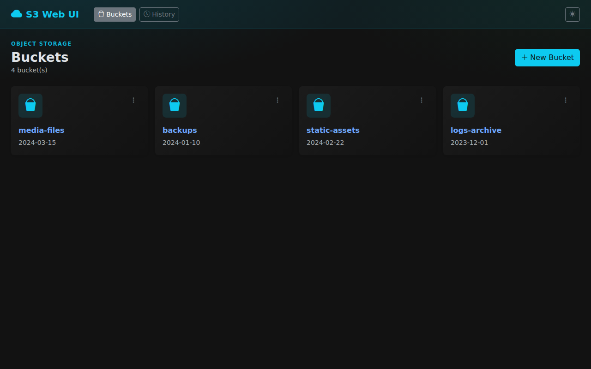
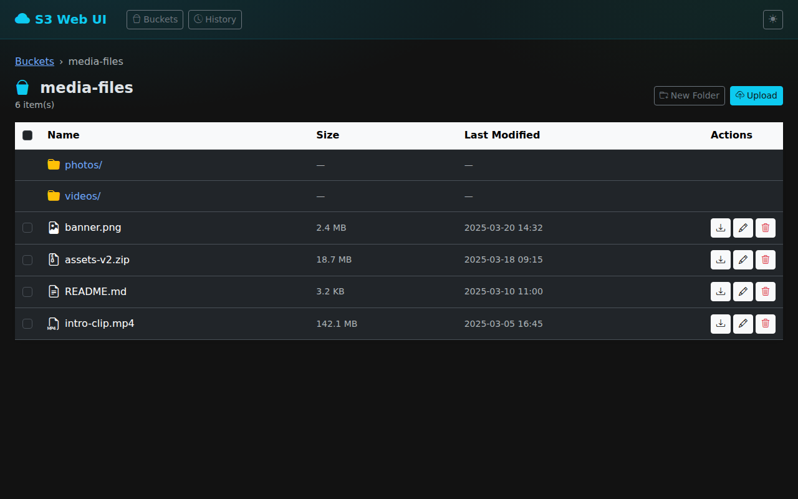
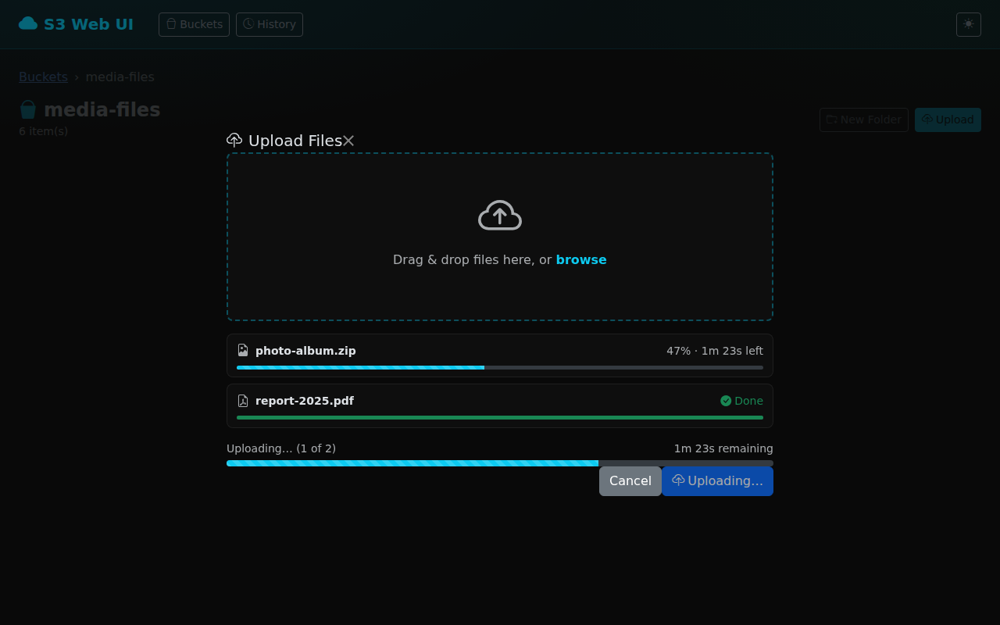
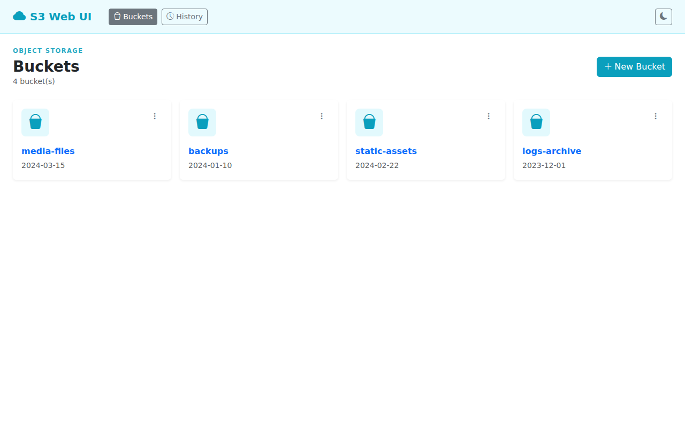

# S3 Web UI

[](https://github.com/wenisch-tech/s3webui/actions/workflows/ci.yml)
[](https://github.com/wenisch-tech/Kairos/releases)
[](LICENSE)
[](https://github.com/wenisch-tech/s3webui/pkgs/container/s3webui)
[](https://github.com/wenisch-tech/Kairos/releases)


A modern, clean graphical web interface for S3-compatible object storage, with optional OIDC Support, audit history and clientside multipart upload built with Spring Boot and Bootstrap 5.  


## Screenshots
Dark theme by default — switch to light with the toggle in the top-right corner.
| Dark theme — Bucket browser | Upload modal with progress | Light theme |
|---|---|---|
| |  |  |

## Features

-  **Browse buckets** — list all buckets with creation date
-  **Navigate folders** — browse objects with breadcrumb navigation
-  **Create buckets** — create new buckets directly from the UI
-  **Upload files** — client-side multipart upload with real-time progress bar and ETA
-  **Download files** — download any object in a single click
-  **Rename objects** — rename files without re-uploading
-  **Delete** — delete individual objects or entire buckets
-  **Folder support** — create virtual folders (prefix-based)
-  **Audit history** — per-session activity log (uploads, downloads, deletes, renames) with user and action filters
-  **Dark / Light theme** — toggle stored in `localStorage`, dark is the default
-  **OIDC** — optional single-sign-on with role-based access control and multiple providers


## Upload flow

Files **≤ 5 MB** are uploaded via a simple multipart form POST through the backend.

Files **> 5 MB** use **server-proxied S3 multipart upload**:
1. Browser calls `POST /api/buckets/{b}/multipart/initiate` to get an `uploadId`
2. For each 5 MB chunk, the browser PUTs the raw bytes to `PUT /api/buckets/{b}/multipart/part` — the backend forwards the chunk directly to S3 using the AWS SDK and returns the `ETag`
3. Browser calls `POST /api/buckets/{b}/multipart/complete` to finish the upload

Routing parts through the backend avoids cross-origin (CORS) issues that would occur if the browser PUTted directly to the S3 endpoint.

Progress percentage and estimated time remaining are computed entirely in the browser using `XMLHttpRequest` upload events.

## Configuration

All settings are provided via environment variables:

### S3 connection

| Variable | Description | Default |
|---|---|---|
| `S3_ACCESS_KEY` | S3 access key / username | `minioadmin` |
| `S3_SECRET_KEY` | S3 secret key / password | `minioadmin` |
| `S3_ENDPOINT_URL` | S3-compatible endpoint URL | `http://localhost:9000` |
| `S3_REGION` | AWS region (optional) | `us-east-1` |
| `S3_INSECURE_SKIP_TLS_VERIFY` | Skip TLS certificate verification for S3 endpoint | `false` |

### OIDC (optional)

| Variable | Description | Default |
|---|---|---|
| `OIDC_ENABLED` | Enable OIDC authentication | `false` |
| `OIDC_PROVIDER_NAME` | Display name for the legacy single-provider setup | `Single Sign-On` |
| `OIDC_CLIENT_ID` | OAuth2 client ID | — |
| `OIDC_CLIENT_SECRET` | OAuth2 client secret | — |
| `OIDC_ISSUER_URI` | OIDC issuer URI for the legacy single-provider setup | — |
| `OIDC_REQUIRED_ROLE` | Realm role required to access the app (optional) | — |
| `OIDC_INSECURE_SKIP_TLS_VERIFY` | Skip TLS certificate verification for the OIDC issuer | `false` |

When `OIDC_ENABLED=true`, unauthenticated users are redirected to the login page where they can sign in via one or more configured OIDC providers.  
If `OIDC_REQUIRED_ROLE` is set, users without that realm role receive an **Access Denied** page.

#### Multiple OIDC providers

To configure multiple providers, use indexed environment variables:

| Variable | Description |
|---|---|
| `OIDC_PROVIDERS_0_NAME` | Button label / display name |
| `OIDC_PROVIDERS_0_CLIENT_ID` | OAuth2 client ID |
| `OIDC_PROVIDERS_0_CLIENT_SECRET` | OAuth2 client secret |
| `OIDC_PROVIDERS_0_ISSUER_URI` | OIDC issuer URI |
| `OIDC_PROVIDERS_0_REGISTRATION_ID` | Optional explicit Spring Security registration id |
| `OIDC_PROVIDERS_0_USER_NAME_ATTRIBUTE` | Optional username claim, defaults to `preferred_username` |

Repeat the same pattern with `_1_`, `_2_`, and so on. Each configured provider is rendered as its own login button.

## Running locally

**Prerequisites:** Java 17+, Maven 3.9+

### Without OIDC

```bash
export S3_ACCESS_KEY=your-access-key
export S3_SECRET_KEY=your-secret-key
export S3_ENDPOINT_URL=http://your-s3-endpoint:9000
export S3_REGION=us-east-1

mvn spring-boot:run
```

Then open <http://localhost:8080> in your browser.

### With a single OIDC provider

```bash
export S3_ACCESS_KEY=your-access-key
export S3_SECRET_KEY=your-secret-key
export S3_ENDPOINT_URL=http://your-s3-endpoint:9000

export OIDC_ENABLED=true
export OIDC_PROVIDER_NAME="Company SSO"
export OIDC_CLIENT_ID=s3webui
export OIDC_CLIENT_SECRET=your-client-secret
export OIDC_ISSUER_URI=http://localhost:8180/realms/myrealm
# Optional — require a specific realm role:
export OIDC_REQUIRED_ROLE=s3-access

mvn spring-boot:run
```

### With multiple OIDC providers

```bash
export S3_ACCESS_KEY=your-access-key
export S3_SECRET_KEY=your-secret-key
export S3_ENDPOINT_URL=http://your-s3-endpoint:9000

export OIDC_ENABLED=true
export OIDC_PROVIDERS_0_NAME="Internal SSO"
export OIDC_PROVIDERS_0_CLIENT_ID=s3webui
export OIDC_PROVIDERS_0_CLIENT_SECRET=internal-secret
export OIDC_PROVIDERS_0_ISSUER_URI=https://auth.example.com/realms/internal

export OIDC_PROVIDERS_1_NAME="Partner Login"
export OIDC_PROVIDERS_1_CLIENT_ID=s3webui-partner
export OIDC_PROVIDERS_1_CLIENT_SECRET=partner-secret
export OIDC_PROVIDERS_1_ISSUER_URI=https://auth.partner.example/realms/partner

mvn spring-boot:run
```

> **OIDC provider setup:** Create a client in your realm/provider with:
> - Client Protocol: `openid-connect`
> - Access Type: `confidential`
> - Valid Redirect URIs: `http://localhost:8080/*`
> - Set the issuer URI to `http://<provider-host>/realms/<realm-name>` or the provider's standard OIDC issuer URL

### Quick start with MinIO

```bash
# Start MinIO
docker run -d -p 9000:9000 -p 9001:9001 \
  -e MINIO_ROOT_USER=minioadmin \
  -e MINIO_ROOT_PASSWORD=minioadmin \
  minio/minio server /data --console-address ":9001"

# Start S3 Web UI
docker run -d -p 8080:8080 \
  -e S3_ACCESS_KEY=minioadmin \
  -e S3_SECRET_KEY=minioadmin \
  -e S3_ENDPOINT_URL=http://host.docker.internal:9000 \
  ghcr.io/wenisch-tech/s3webui:latest
```

## Docker

```bash
docker run -d -p 8080:8080 \
  -e S3_ACCESS_KEY=your-access-key \
  -e S3_SECRET_KEY=your-secret-key \
  -e S3_ENDPOINT_URL=http://your-s3-endpoint:9000 \
  -e S3_REGION=us-east-1 \
  ghcr.io/wenisch-tech/s3webui:latest
```

With OIDC:

```bash
docker run -d -p 8080:8080 \
  -e S3_ACCESS_KEY=your-access-key \
  -e S3_SECRET_KEY=your-secret-key \
  -e S3_ENDPOINT_URL=http://minio:9000 \
  -e OIDC_ENABLED=true \
  -e OIDC_PROVIDER_NAME="Company SSO" \
  -e OIDC_CLIENT_ID=s3webui \
  -e OIDC_CLIENT_SECRET=your-client-secret \
  -e OIDC_ISSUER_URI=http://oidc:8080/realms/myrealm \
  -e OIDC_REQUIRED_ROLE=s3-access \
  ghcr.io/wenisch-tech/s3webui:latest
```

## Helm chart

```bash
helm repo add wenisch-tech https://charts.wenisch.tech
helm repo update

helm install s3webui wenisch-tech/s3webui \
  --set env.S3_ENDPOINT_URL=http://minio:9000 \
  --set secrets.S3_ACCESS_KEY=your-access-key \
  --set secrets.S3_SECRET_KEY=your-secret-key
```

### Example `values.yaml` with multiple OIDC providers

```yaml
env:
  S3_ENDPOINT_URL: "http://minio.minio.svc.cluster.local:9000"
  S3_REGION: "us-east-1"
  OIDC_ENABLED: "true"
  OIDC_PROVIDERS_0_NAME: "Internal SSO"
  OIDC_PROVIDERS_0_CLIENT_ID: "s3webui"
  OIDC_PROVIDERS_0_ISSUER_URI: "http://keycloak.auth.svc.cluster.local:8080/realms/myrealm"
  OIDC_PROVIDERS_1_NAME: "Partner Login"
  OIDC_PROVIDERS_1_CLIENT_ID: "s3webui-partner"
  OIDC_PROVIDERS_1_ISSUER_URI: "https://partner-idp.example.com/realms/partner"
  OIDC_REQUIRED_ROLE: "s3-access"

secrets:
  S3_ACCESS_KEY: "your-access-key"
  S3_SECRET_KEY: "your-secret-key"
  OIDC_PROVIDERS_0_CLIENT_SECRET: "your-client-secret"
  OIDC_PROVIDERS_1_CLIENT_SECRET: "your-other-client-secret"

ingress:
  enabled: true
  className: nginx
  hosts:
    - host: s3webui.example.com
      paths:
        - path: /
          pathType: Prefix
```

## Building from source

```bash
mvn -B package -DskipTests
java -jar target/s3webui-*.jar
```


## Contributing
Pull requests welcomed.

> **Please note :** CVE scanning via [Trivy](https://github.com/aquasecurity/trivy) is an essential part of the development process and runs automatically on every pull request. Fixing identified vulnerabilities is a mandatory step before merging.

## License

AGPL-3.0 — see [LICENSE](LICENSE) for details.

Copyright (C) 2026 Jean-Fabian Wenisch / wenisch.tech
