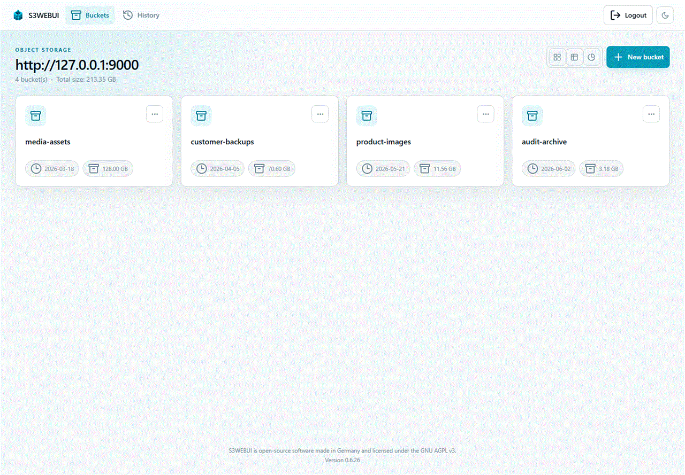

# S3 Web UI

[](https://github.com/wenisch-tech/s3webui/actions/workflows/ci.yml)
[](https://github.com/wenisch-tech/Kairos/releases)
[](LICENSE)
[](https://github.com/wenisch-tech/s3webui/pkgs/container/s3webui)
[](https://github.com/wenisch-tech/Kairos/releases)



A modern, clean graphical web interface for S3-compatible object storage, with local and optional OIDC authentication, audit history, administration, and client-side multipart upload. Built with Spring Boot, Tailwind CSS, Alpine.js, and Lucide.


> [!IMPORTANT]
> **Breaking change since 0.7.0 — the application always requires a sign-in.**
> Earlier versions were open to everyone when `OIDC_ENABLED=false`. On first start a default
> administrator `admin@s3webui.local` / `admin` is created and a warning is logged; change that
> password immediately, or set `ADMIN_EMAIL` / `ADMIN_PASSWORD` before the first start.
> S3 credentials are now managed in the administration panel rather than only through
> `S3_ACCESS_KEY` / `S3_SECRET_KEY`.

## How access works

1. A user signs in — with e-mail and password, or through an OIDC provider.
2. They pick which **S3 key** to use for this session. A key is an S3 connection an administrator
   configured under **Settings → S3 keys**, and each key is granted to *everyone signed in*, to a
   *named user* (by e-mail), to a *role*, or to a *group* — roles and groups come from the claims
   the identity provider sends. Administrators see every key.
3. The bucket browser loads with that key. The navbar switcher changes key without signing out.

Users may also connect with credentials they type in themselves; administrators can switch that off
under **Settings → General**. Grants are re-checked on every request, so revoking one takes effect
immediately.

## Product tour

The walkthrough above uses fictional demo data in the real application UI and cycles through card, list, and chart views, object browsing, file selection, audit history, S3 connection setup, and sign-in.

## Features

-  **Browse buckets** — list all buckets with creation date
-  **Navigate folders** — browse objects with breadcrumb navigation
-  **Create buckets** — create new buckets directly from the UI
-  **Upload files** — client-side multipart upload with real-time progress bar and ETA
-  **Download files** — download any object in a single click
-  **Rename objects** — rename files without re-uploading
-  **Delete** — delete individual objects or entire buckets
-  **Folder support** — create virtual folders (prefix-based)
-  **Audit history** — per-session activity log (uploads, downloads, deletes, renames) with user and action filters
-  **Light / Dark theme** — toggle stored in `localStorage`, light is the default
-  **Administration panel** — manage named S3 keys, decide who may use each one, and manage local accounts
-  **Per-user S3 sessions** — every signed-in user picks their own key; several users browse different storage at the same time
-  **Encrypted secrets** — stored S3 secret keys are encrypted at rest with AES-256-GCM
-  **Users & roles** — local accounts in an H2 or PostgreSQL database, with a seeded default administrator
-  **OIDC** — optional single-sign-on with role-based access control and multiple providers


## Upload flow

Files **≤ 5 MB** are uploaded via a simple multipart form POST through the backend.

Files **> 5 MB** use **server-proxied S3 multipart upload**:
1. Browser calls `POST /api/buckets/{b}/multipart/initiate` to get an `uploadId`
2. For each 5 MB chunk, the browser PUTs the raw bytes to `PUT /api/buckets/{b}/multipart/part` — the backend forwards the chunk directly to S3 using the AWS SDK and returns the `ETag`
3. Browser calls `POST /api/buckets/{b}/multipart/complete` to finish the upload

Routing parts through the backend avoids cross-origin (CORS) issues that would occur if the browser PUTted directly to the S3 endpoint.

Progress percentage and estimated time remaining are computed entirely in the browser using `XMLHttpRequest` upload events.

## Configuration

Runtime configuration lives in the administration panel; deployment configuration is provided via
environment variables.

### Database

The application ships with an H2 file database and needs no configuration. Point the standard Spring
datasource variables at PostgreSQL for production; no profile is needed.

| Variable | Description | Default |
|---|---|---|
| `APP_DATA_DIR` | Directory holding the H2 database and the generated encryption key | `./data` (`/app/data` in the container) |
| `SPRING_DATASOURCE_URL` | JDBC URL | `jdbc:h2:file:${APP_DATA_DIR}/s3webui` |
| `SPRING_DATASOURCE_DRIVER_CLASS_NAME` | JDBC driver | `org.h2.Driver` |
| `SPRING_DATASOURCE_USERNAME` | Database user | `sa` |
| `SPRING_DATASOURCE_PASSWORD` | Database password | — |
| `SPRING_JPA_DATABASE_PLATFORM` | Set to `org.hibernate.dialect.PostgreSQLDialect` for PostgreSQL | — |

The H2 file database tolerates a single writer, so keep `replicaCount: 1`. Running more than one
replica needs PostgreSQL **and** sticky sessions, because HTTP sessions are held in memory.

### Administrator and secret encryption

| Variable | Description | Default |
|---|---|---|
| `ADMIN_EMAIL` | E-mail of the administrator created on first start | `admin@s3webui.local` |
| `ADMIN_PASSWORD` | Its password. Change it after the first sign-in | `admin` |
| `APP_ENCRYPTION_KEY` | Base64 encoded 32 byte AES key protecting stored S3 secrets | generated into `${APP_DATA_DIR}/encryption.key` |

If you let the key be generated, **`${APP_DATA_DIR}` must be on persistent storage** — without that
file the stored S3 secret keys cannot be decrypted. The administrator is created only when the user
table is empty; changing `ADMIN_PASSWORD` later has no effect.

### S3 connection

| Variable | Description | Default |
|---|---|---|
| `S3_ACCESS_KEY` | S3 access key / username | `minioadmin` |
| `S3_SECRET_KEY` | S3 secret key / password | `minioadmin` |
| `S3_ENDPOINT_URL` | S3-compatible endpoint URL | `http://localhost:9000` |
| `S3_REGION` | AWS region (optional) | `us-east-1` |
| `S3_INSECURE_SKIP_TLS_VERIFY` | Skip TLS certificate verification for S3 endpoint | `false` |

These are optional. When all three of `S3_ACCESS_KEY`, `S3_SECRET_KEY` and `S3_ENDPOINT_URL` are
set, they appear in the key picker as a built-in key available to every signed-in user. It is shown
read-only in the administration panel; every other key is created there and stored encrypted.

### OIDC (optional)

| Variable | Description | Default |
|---|---|---|
| `OIDC_ENABLED` | Enable OIDC authentication | `false` |
| `OIDC_PROVIDER_NAME` | Display name for the legacy single-provider setup | `Single Sign-On` |
| `OIDC_CLIENT_ID` | OAuth2 client ID | — |
| `OIDC_CLIENT_SECRET` | OAuth2 client secret | — |
| `OIDC_ISSUER_URI` | OIDC issuer URI for the legacy single-provider setup | — |
| `OIDC_REQUIRED_ROLE` | Realm role required to access the app (optional) | — |
| `OIDC_CREATEUSERS` | Create a local record the first time an unknown SSO user signs in | `true` |
| `OIDC_INSECURE_SKIP_TLS_VERIFY` | Skip TLS certificate verification for the OIDC issuer | `false` |

When `OIDC_ENABLED=true`, the login page offers a button per configured provider alongside the local
sign-in form. The token must carry an e-mail address, which becomes the user's identity; a login
without one is rejected. With `OIDC_CREATEUSERS=false`, only users an administrator created up front
may sign in.

Administrator status always comes from the database, never from the token, so a realm role called
`admin` cannot promote anyone — promote users under **Settings → Users**. Realm roles, client roles
and the `groups` claim are still read from the token, because credential grants target them.

If `OIDC_REQUIRED_ROLE` is set, users without that realm role receive an **Access Denied** page.

#### Running behind a reverse proxy or ingress

`SERVER_FORWARD_HEADERS_STRATEGY` defaults to `framework`, so `X-Forwarded-*` headers from a
TLS-terminating proxy are honored automatically — the redirect URI sent to the identity provider uses
the public `https://` origin rather than the plain `http://` one the proxy actually connects to the
pod with. This is a no-op when there is no proxy in front, so it's safe to leave on for local testing.

The OIDC flow stores a short-lived pending authorization request in the session between the redirect
to the identity provider and the callback. If that request lands on a different replica, or the
session cookie doesn't round-trip on the callback, the sign-in fails with `authorization_request_not_found`
in the log; two things are worth checking if SSO login redirects you back to a generic error:

- Keep `replicaCount: 1` unless sessions are shared (see the database/persistence section above) —
  the callback has to land on the same instance that issued the redirect.
- Behind TLS, set `SERVER_SERVLET_SESSION_COOKIE_SAME_SITE=None` and `SERVER_SERVLET_SESSION_COOKIE_SECURE=true`
  (both are standard Spring Boot properties, no code change needed) if the session cookie isn't making
  it back on the callback. Don't set `SECURE=true` without TLS in front — browsers refuse to send
  `Secure` cookies over plain HTTP, which would break sign-in entirely.

#### Multiple OIDC providers

To configure multiple providers, use indexed environment variables:

| Variable | Description |
|---|---|
| `OIDC_PROVIDERS_0_NAME` | Button label / display name |
| `OIDC_PROVIDERS_0_CLIENT_ID` | OAuth2 client ID |
| `OIDC_PROVIDERS_0_CLIENT_SECRET` | OAuth2 client secret |
| `OIDC_PROVIDERS_0_ISSUER_URI` | OIDC issuer URI |
| `OIDC_PROVIDERS_0_REGISTRATION_ID` | Optional explicit Spring Security registration id |
| `OIDC_PROVIDERS_0_USER_NAME_ATTRIBUTE` | Optional username claim, defaults to `preferred_username` |

Repeat the same pattern with `_1_`, `_2_`, and so on. Each configured provider is rendered as its own login button.

## Running locally

**Prerequisites:** Java 17+, Maven 3.9+

### Without OIDC

```bash
mvn spring-boot:run
```

Then open <http://localhost:8080> and sign in as `admin@s3webui.local` / `admin` (the password is
logged as a warning on first start). Add your storage under **Settings → S3 keys**, or pre-seed a
built-in key from the environment:

```bash
export S3_ACCESS_KEY=your-access-key
export S3_SECRET_KEY=your-secret-key
export S3_ENDPOINT_URL=http://your-s3-endpoint:9000
export S3_REGION=us-east-1

mvn spring-boot:run
```

### With a single OIDC provider

```bash
export S3_ACCESS_KEY=your-access-key
export S3_SECRET_KEY=your-secret-key
export S3_ENDPOINT_URL=http://your-s3-endpoint:9000

export OIDC_ENABLED=true
export OIDC_PROVIDER_NAME="Company SSO"
export OIDC_CLIENT_ID=s3webui
export OIDC_CLIENT_SECRET=your-client-secret
export OIDC_ISSUER_URI=http://localhost:8180/realms/myrealm
# Optional — require a specific realm role:
export OIDC_REQUIRED_ROLE=s3-access

mvn spring-boot:run
```

### With multiple OIDC providers

```bash
export S3_ACCESS_KEY=your-access-key
export S3_SECRET_KEY=your-secret-key
export S3_ENDPOINT_URL=http://your-s3-endpoint:9000

export OIDC_ENABLED=true
export OIDC_PROVIDERS_0_NAME="Internal SSO"
export OIDC_PROVIDERS_0_CLIENT_ID=s3webui
export OIDC_PROVIDERS_0_CLIENT_SECRET=internal-secret
export OIDC_PROVIDERS_0_ISSUER_URI=https://auth.example.com/realms/internal

export OIDC_PROVIDERS_1_NAME="Partner Login"
export OIDC_PROVIDERS_1_CLIENT_ID=s3webui-partner
export OIDC_PROVIDERS_1_CLIENT_SECRET=partner-secret
export OIDC_PROVIDERS_1_ISSUER_URI=https://auth.partner.example/realms/partner

mvn spring-boot:run
```

> **OIDC provider setup:** Create a client in your realm/provider with:
> - Client Protocol: `openid-connect`
> - Access Type: `confidential`
> - Valid Redirect URIs: `http://localhost:8080/*`
> - Set the issuer URI to `http://<provider-host>/realms/<realm-name>` or the provider's standard OIDC issuer URL

### Quick start with MinIO

```bash
# Start MinIO
docker run -d -p 9000:9000 -p 9001:9001 \
  -e MINIO_ROOT_USER=minioadmin \
  -e MINIO_ROOT_PASSWORD=minioadmin \
  minio/minio server /data --console-address ":9001"

# Start S3 Web UI
docker run -d -p 8080:8080 \
  -v s3webui-data:/app/data \
  -e S3_ACCESS_KEY=minioadmin \
  -e S3_SECRET_KEY=minioadmin \
  -e S3_ENDPOINT_URL=http://host.docker.internal:9000 \
  ghcr.io/wenisch-tech/s3webui:latest
```

Sign in as `admin@s3webui.local` / `admin`, then change the password under **Settings → Users**.

## Docker

Mount a volume on `/app/data`: it holds the H2 database and the generated encryption key, without
which stored S3 secrets cannot be decrypted.

```bash
docker run -d -p 8080:8080 \
  -v s3webui-data:/app/data \
  -e ADMIN_EMAIL=admin@example.com \
  -e ADMIN_PASSWORD=choose-something-better \
  ghcr.io/wenisch-tech/s3webui:latest
```

With PostgreSQL and a supplied encryption key, no volume is needed:

```bash
docker run -d -p 8080:8080 \
  -e SPRING_DATASOURCE_URL=jdbc:postgresql://postgres:5432/s3webui \
  -e SPRING_DATASOURCE_DRIVER_CLASS_NAME=org.postgresql.Driver \
  -e SPRING_DATASOURCE_USERNAME=s3webui \
  -e SPRING_DATASOURCE_PASSWORD=secret \
  -e SPRING_JPA_DATABASE_PLATFORM=org.hibernate.dialect.PostgreSQLDialect \
  -e APP_ENCRYPTION_KEY="$(openssl rand -base64 32)" \
  ghcr.io/wenisch-tech/s3webui:latest
```

With OIDC:

```bash
docker run -d -p 8080:8080 \
  -e S3_ACCESS_KEY=your-access-key \
  -e S3_SECRET_KEY=your-secret-key \
  -e S3_ENDPOINT_URL=http://minio:9000 \
  -e OIDC_ENABLED=true \
  -e OIDC_PROVIDER_NAME="Company SSO" \
  -e OIDC_CLIENT_ID=s3webui \
  -e OIDC_CLIENT_SECRET=your-client-secret \
  -e OIDC_ISSUER_URI=http://oidc:8080/realms/myrealm \
  -e OIDC_REQUIRED_ROLE=s3-access \
  ghcr.io/wenisch-tech/s3webui:latest
```

## Helm chart

```bash
helm repo add wenisch-tech https://charts.wenisch.tech
helm repo update

helm install s3webui wenisch-tech/s3webui \
  --set persistence.enabled=true \
  --set secrets.ADMIN_PASSWORD=choose-something-better
```

`persistence.enabled=true` claims a volume for `/app/data`. Skip it only when you run PostgreSQL and
set `secrets.APP_ENCRYPTION_KEY` yourself.

### Example `values.yaml` with multiple OIDC providers

```yaml
persistence:
  enabled: true
  size: 1Gi

env:
  ADMIN_EMAIL: "admin@example.com"
  S3_ENDPOINT_URL: "http://minio.minio.svc.cluster.local:9000"
  S3_REGION: "us-east-1"
  OIDC_ENABLED: "true"
  OIDC_PROVIDERS_0_NAME: "Internal SSO"
  OIDC_PROVIDERS_0_CLIENT_ID: "s3webui"
  OIDC_PROVIDERS_0_ISSUER_URI: "http://keycloak.auth.svc.cluster.local:8080/realms/myrealm"
  OIDC_PROVIDERS_1_NAME: "Partner Login"
  OIDC_PROVIDERS_1_CLIENT_ID: "s3webui-partner"
  OIDC_PROVIDERS_1_ISSUER_URI: "https://partner-idp.example.com/realms/partner"
  OIDC_REQUIRED_ROLE: "s3-access"

secrets:
  ADMIN_PASSWORD: "choose-something-better"
  S3_ACCESS_KEY: "your-access-key"
  S3_SECRET_KEY: "your-secret-key"
  OIDC_PROVIDERS_0_CLIENT_SECRET: "your-client-secret"
  OIDC_PROVIDERS_1_CLIENT_SECRET: "your-other-client-secret"

ingress:
  enabled: true
  className: nginx
  hosts:
    - host: s3webui.example.com
      paths:
        - path: /
          pathType: Prefix
```

## Building from source

```bash
mvn -B package -DskipTests
java -jar target/s3webui-*.jar
```


## Contributing
Pull requests welcomed.

> **Please note :** CVE scanning via [Trivy](https://github.com/aquasecurity/trivy) is an essential part of the development process and runs automatically on every pull request. Fixing identified vulnerabilities is a mandatory step before merging.

## License

AGPL-3.0 — see [LICENSE](LICENSE) for details.

Copyright (C) 2026 Jean-Fabian Wenisch / wenisch.tech
